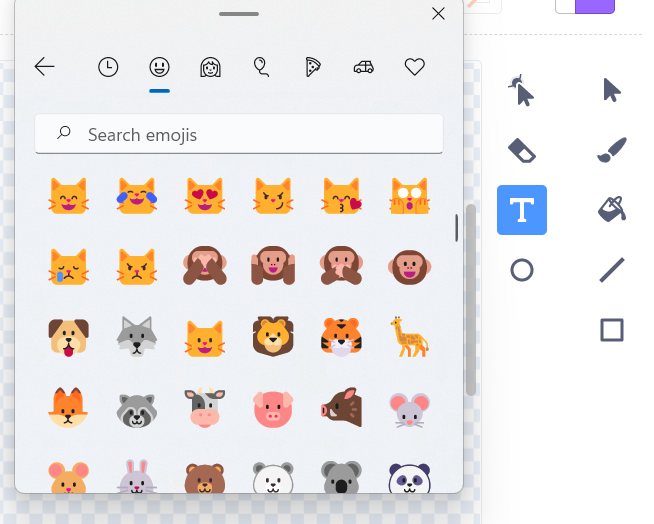
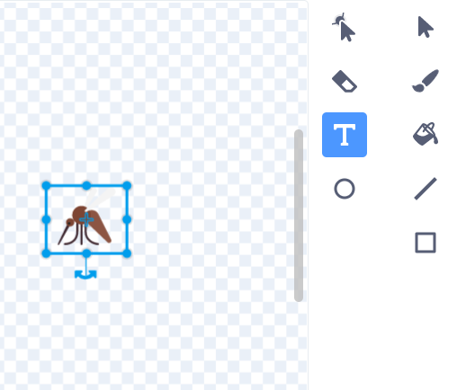

يمكنك استخدام لوحة مفاتيح الرموز التعبيرية (الايموجي) لإضافة الرموز التعبيرية في أي مكان يمكنك فيه كتابة نص في Scratch.

بدلاً من كتابة نص، استخدم اختصار لوحة مفاتيح للإيموجي الخاصة بنظام التشغيل الخاص بك:
- نظام التشغيل Windows - مفتاح Windows + "."
- نظام التشغيل MacOS استخدم - ctrl + cmd + space
- نظام تشغيل Linux استخدم - ctrl + "."

يمكنك استخدام الرموز التعبيرية في قيمة المتغيرات:
```blocks3
set [موسيقى v] to [🎵]
```



أو ، في أداة **نص** في محرر الرسام.



**نصيحة:** يمكن أن تبدو الإيموجي مختلفة على أجهزة كمبيوتر مختلفة، لذلك قد لا تبدو متشابهة على الكمبيوتر اللوحي وجهاز الكمبيوتر المنضدي. لا تتوفر بعض رموز الإيموجي على بعض أجهزة الكمبيوتر، ولكن معظم أجهزة الكمبيوتر الحديثة تدعمها.

