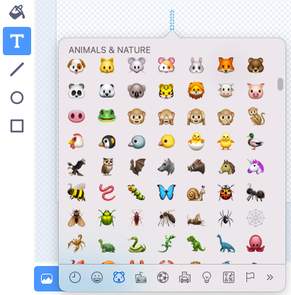
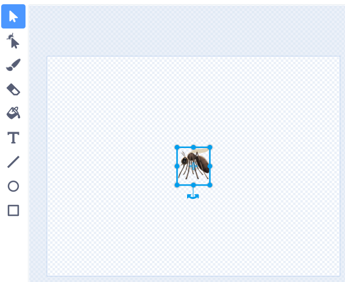

You can use the emoji keyboard to add use emojis anywhere you can type text in Scratch.  

Instead of typing text use the emoji keyboard shortcut for your Operating System:
- Windows - Windows key + '.'
- MacOS - ctrl + cmd + space
- Linux - ctrl + '.'

You can use emojis in the value of a variables:
```blocks3
set [music v] to [🎵]
```



Or, in the **Text** tool in the Paint editor.  



**Tip:** Emojis can look different on different computers so they might not look the same on a tablet and a desktop computer. Some emojis aren't available on some computers, but most modern computers will support them.
