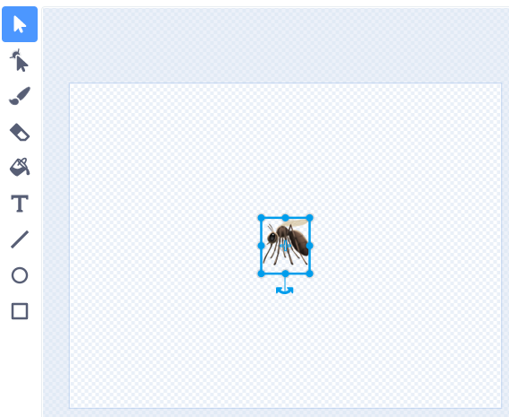

Tu peux utiliser le clavier émoji pour ajouter des émojis partout où tu peux taper du texte dans Scratch.

Au lieu de taper du texte, utilise le raccourci clavier émoji pour ton système d'exploitation :
- Windows - Touche Windows + "."
- macOS - ctrl + cmd + espace
- Linux - ctrl + "."

Tu peux utiliser des émojis dans la valeur d'une variable :
```blocks3
set [music v] to [🎵]
```


Ou, dans l'outil **Texte** de l'éditeur de peinture.



**Astuce :** Les émojis peuvent avoir un aspect différent sur différents ordinateurs, ils peuvent donc ne pas être identiques sur une tablette et sur un ordinateur de bureau. Certains emojis ne sont pas disponibles sur certains ordinateurs, mais la plupart des ordinateurs modernes les prendront en charge.
