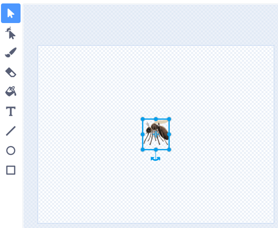

絵文字キーボードを使用すると、スクラッチでテキストを入力できる場所ならどこでも絵文字を追加できます。

テキストを入力する代わりに、オペレーティングシステムの絵文字キーボード・ショートカットを使ってみましょう。
- Windows - Windowsキー + '.'
- MacOS - ctrl + cmd + スペース
- Linux - Ctrl + '.'

変数の値に絵文字を使用できます。
```blocks3
set [音楽 v] to [🎵]
```


または、ペイントエディタの**テキスト**ツールでも使用できます。



**ヒント:** 絵文字はコンピューターによって見え方が異なることがあるため、タブレットとデスクトップコンピューターでは同じように見えない場合があります。 絵文字によっては一部のコンピューターでは使用できませんが、最近のほとんどのコンピューターは大部分の絵文字を使うことができます。
