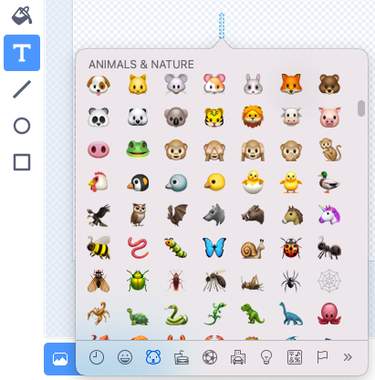

Você pode usar o teclado emoji para adicionar emojis em qualquer lugar que você pode digitar o texto no Scratch.

Em vez de digitar o texto, use o atalho para teclado de emoji do Sistema Operacional:
- Windows - Tecla Windows + "."
- MacOS - ctrl + cmd + espaço
- Linux - ctrl + "."

Você pode usar emojis no valor de uma variável:
```blocks3
set [música v] to [🎵]
```



Ou, no ícone de **Texto** na aba "Fantasias".


**Dica:** Emojis podem parecer diferentes em computadores diferentes, então eles podem não ter a mesma aparência em um tablet e um computador desktop. Alguns emojis não estão disponíveis em alguns computadores, mas a maioria dos computadores modernos os suporta.
